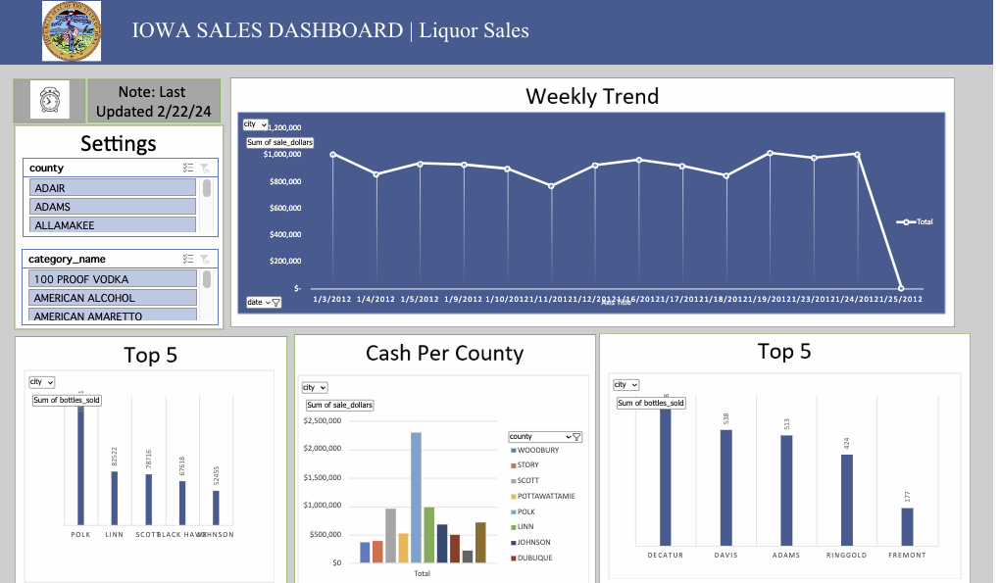

<h1 align="center">Iowa Sales Dashboard</h1>

  

  
  

  

    Badge <a href="https://shields.io/">Source</a>
  

  <h2>Authors</h2>
  <ul>
    <li><a href="https://github.com/dsrichard97">@dsrichard97</a></li>
  </ul>

  <h2>Table of Contents</h2>
  <ul>
    <li><a href="#business-problem" target="_parent">Business Problem</a></li>
    <li><a href="#data-source">Data Source</a></li>
    <li><a href="#methods">Methods</a></li>
    <li><a href="#tech-stack">Tech Stack</a></li>
    <li><a href="#quick-glance">Quick glance at the Results</a></li>
    <li><a href="#lesson-learned">Lessons learned and Recommendation</a></li>
    <li><a href="#limitation">Limitation and what can be Improved</a></li>
    <li><a href="#notebook">Explore the notebook</a></li>
    <li><a href="#contribution">Contribution</a></li>
    <li><a href="#license">License</a></li>
  </ul>

  <section id="business-problem">
    <h2>Business Problem</h2>
    

      Create an interactive dashboard that visualizes various aspects of liquor sales in Iowa, including sales trends over time, comparisons of sales across different counties or cities, and insights into the TOP counties sales.
    

  </section>

  <section id="data-source">
    <h2>Data Source</h2>
    

      The Iowa liquor sales dataset provides a comprehensive overview of wholesale purchases of liquor by retailers in the State of Iowa from January 1, 2012. As the State of Iowa controls the wholesale distribution of liquor for retail sale, this dataset gives a complete view of the retail liquor sales across the state. It encompasses wholesale orders made by various types of stores including grocery stores, liquor stores, and convenience stores. The dataset set spans for at least 28389280 rows, however, for the sake of reporting I used a sample data shrunk to 113131 rows.
    

    <ul>
      <li><a href="https://csulb-my.sharepoint.com/:x:/g/personal/richard_diazdeleon01_student_csulb_edu/EYtynGus5R5DgXCk1WKdp-0BgBeH8GJF2gsOJ7Mf8YYZ6g?e=mtq3Bs">Excel Sharepoint</a></li>
    </ul>
  </section>

  <section id="methods">
    <h2>Methods</h2>
    <ul>
      <li>SQL Code</li>
      <li>Excel Dashboard</li>
      <li>Tableau Dashboard</li>
      <li>SQL Generated Report - Looker </li>
      <li>PowerPoint</li>
    </ul>
  </section>

  <section id="tech-stack">
    <h2>Tech Stack</h2>
    <ul>
      <li>Google Cloud(Google BigQuery)</li>
      <li>Excel </li>
      <li>Looker Studio(SQL Report)</li>
      <li>PowerBI</li>
    </ul>
  </section>

  <section id="quick-glance">
    <h2>Quick Glance at the Results</h2>
      

      SQL pull from database - Uses LIVE data for extraction
      

        
      

    

      Excel dashboard
      

        
      

     

      Looker Studio - SQL Generating Report
      

        
      

    

    

      PowerBI
      

        
      

    

      <ul>
          <b>Visualizations Database: The goal is to craft compelling narratives for stakeholders. </b>
          <li>The narrative behind each dashboard is informed by the evolving landscape of software tools available for data storytelling, each offering unique perspectives on the same dataset. Initially, an SQL query was executed to retrieve specific fields critical for analyzing the sales volume and revenue generated from liquor sales, with the dataset spanning back to January 1, 2012. This period has seen a general uptrend in retail sales through the wholesale distribution of liquor, albeit with occasional declines.

The primary objective shifted towards a granular analysis at the city and county levels, aiming to decipher the nuances of Iowa's local markets. Store data was meticulously collected to include city and county information, facilitating this localized approach.

The Excel dashboard was crafted to provide a straightforward visualization of the leading counties by volume and sales, showcasing the top percentages in an accessible format. This tool simplifies the identification of key performers in the state's liquor market.

Additionally, the SQL report was developed to empower users with the capability to effortlessly generate detailed reports, enhancing the utility and user-friendliness of the data analysis process.

Lastly, the PowerBI dashboard was meticulously designed to not only track daily sales data but also to zoom in on local area details at a micro-level. This approach offers a dynamic and detailed view of sales trends, enabling stakeholders to make informed decisions based on up-to-date, localized information.

Together, these dashboards serve distinct purposes: from offering high-level overviews of market leaders to enabling deep dives into daily sales and local market dynamics. Each tool complements the others, providing a comprehensive toolkit for stakeholders to understand and act upon the intricacies of Iowa's liquor sales landscape. </li>
        </ul>
  </section>

  <section id="lesson-learned">
  <h2>Lessons Learned and Recommendation</h2>
  

    <ul>
      <li>During this project, I acquired valuable skills in utilizing SQL reports and crafting interactive dashboards. The initial step involved extracting relevant data from a stored database to generate <b>Liquor Sales and Visualizations</b>. A significant insight from this endeavor was the focus on daily sales across most dashboards, aligning with the project's objective to present different iterations of the same narrative, akin to dashboard reporting for stakeholders.

However, it became evident that reducing the dataset could lead to a loss of information in other areas. This underscores the delicate balance between data comprehensiveness and specificity, especially in a professional setting where certain features may be prioritized based on managerial feedback and the necessity for continual adjustments. The robustness of the data is noteworthy, offering sufficient detail for even a novice to understand. </li> 
    </ul>
  

